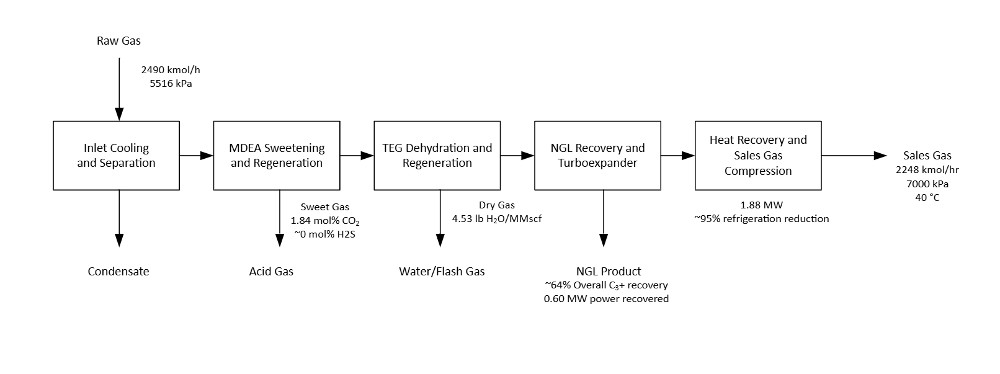
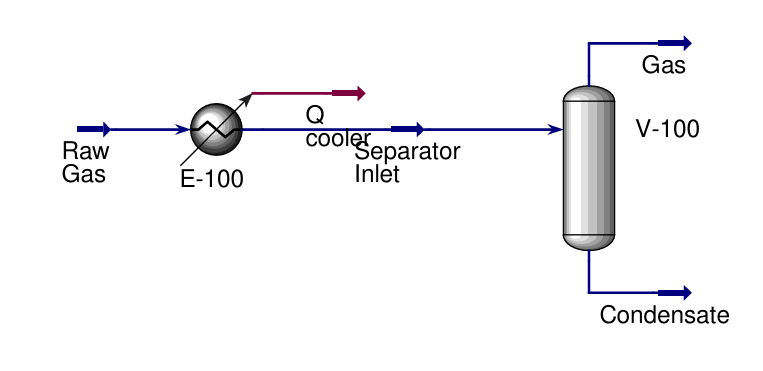
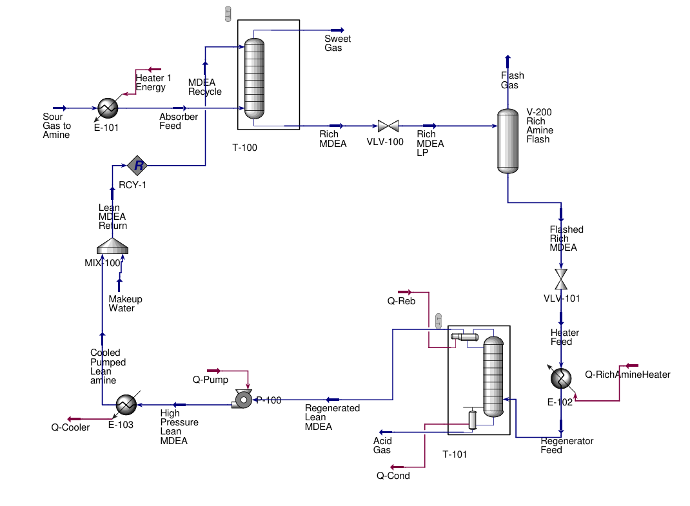
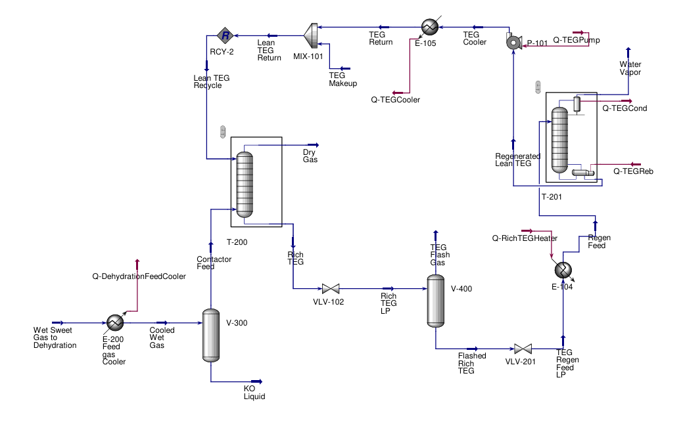
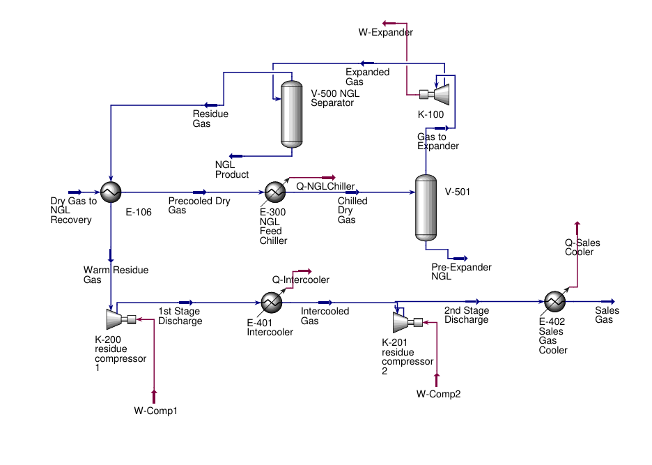

# Natural-Gas-Processing-HYSYS
Aspen HYSYS simulation of an integrated natural gas processing plant with MDEA sweetening, TEG dehydration, NGL recovery, heat integration, and sales-gas compression.
# Integrated Natural Gas Processing Plant Design Using Aspen HYSYS

Independent chemical engineering process simulation of an integrated natural gas processing plant developed in Aspen HYSYS.

The process includes:

- Inlet cooling and separation
- MDEA acid-gas sweetening and regeneration
- TEG dehydration and regeneration
- Low-temperature NGL recovery
- Joule-Thomson vs. turboexpander comparison
- Heat integration
- Two-stage sales-gas compression
- Screening-level energy and economic analysis
- Simplified HAZOP review

## Full Technical Report

**[View the complete 30-page technical report](./Integrated_Natural_Gas_Processing_Plant_Design.pdf)**

## Key Results

| Metric | Result |
|---|---:|
| Raw gas feed | 2,490 kmol/h |
| Feed pressure | 5,516 kPa |
| CO2 | 2.50 → 1.84 mol% after MDEA |
| H2S | 0.05 mol% → ~0 mol% |
| Dry-gas water content | 4.53 lb H2O/MMscf |
| Overall C3+ recovery | ~64% |
| Feed methane retained in sales gas | 96.8% |
| Turboexpander power recovery | 0.599 MW |
| Internal heat recovery | 1.88 MW |
| NGL refrigeration reduction | ~95% |
| Estimated energy-cost benefit | ~$0.78 million/yr* |

\*Based on the project assumptions described in the report and does not include capital costs.

## Process Overview

The model begins with inlet cooling and separation followed by MDEA sweetening and TEG dehydration. The dry gas is then cooled for NGL recovery, where JT throttling and turboexpansion were compared. A turboexpander was selected for the final configuration.

Cold residue gas from the NGL separator was then used to precool the incoming process stream, significantly reducing the external refrigeration requirement. The residue gas was finally recompressed in two stages to the selected sales-gas pressure.

Sensitivity studies were performed for TEG circulation rate, NGL cooling temperature, and turboexpander outlet pressure.

## Selected HYSYS Flowsheets

### Inlet Cooling and Separation

  

Raw natural gas is cooled in E-100 and sent to the V-100 inlet separator to remove condensed liquid before MDEA treatment.

### MDEA Sweetening and Regeneration

  

The MDEA section removes essentially all H2S and reduces CO2 from 2.50 mol% to approximately 1.84 mol%. Rich solvent is flashed and regenerated before being recycled to the absorber.

### TEG Dehydration and Regeneration

  

A closed-loop TEG system reduces the dry-gas water content to approximately 4.53 lb H2O/MMscf before low-temperature NGL recovery.

### NGL Recovery, Heat Integration, and Compression

  

The dry gas is precooled, separated before expansion, and expanded through a turboexpander for additional NGL recovery. Cold residue gas is used for heat integration before two-stage sales-gas compression.

## Full Technical Report

[View the full project report](./Integrated_Natural_Gas_Processing_Plant_Design - Brian Ahn.pdf)

## Software

- Aspen HYSYS
- Microsoft Excel
- LaTeX / Overleaf

## Author

Brian Ahn  
B.S. Chemical Engineering  
Northwestern University
